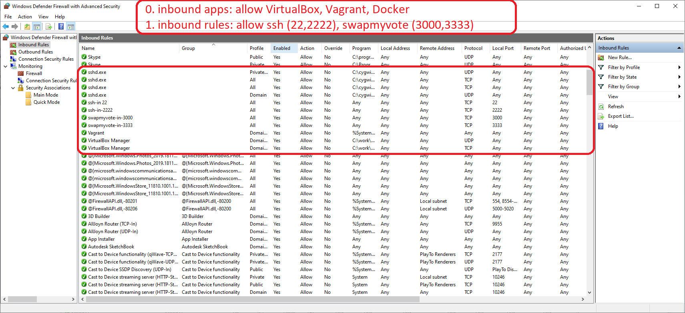
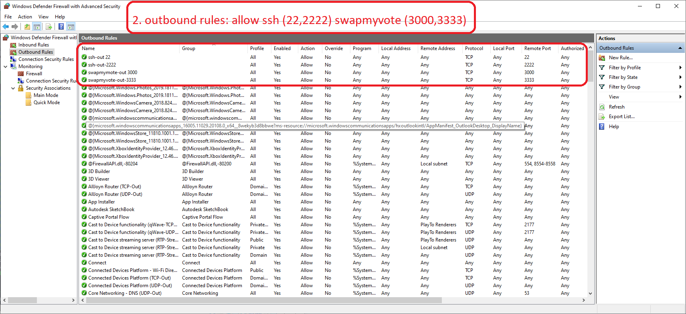
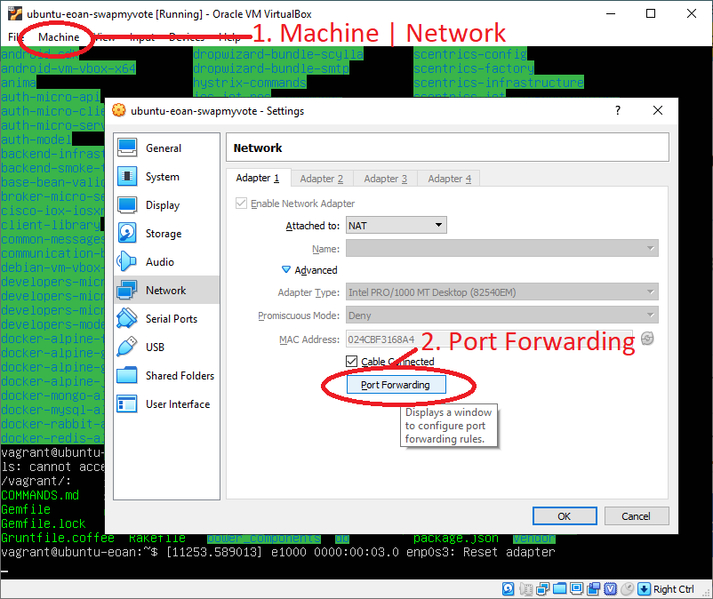
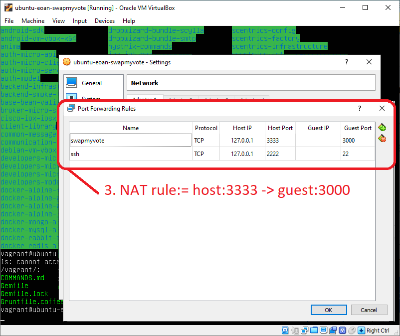

════════════════════════════════════════════════════════════════════════════
# Vagrant-Ubuntu-Eoan-Swapmyvote
════════════════════════════════════════════════════════════════════════════

Ubuntu 18 GNU linux (Eoan Ermine 64) VM, VirtualBox machine, Vagrant provisioner, x64 architecture.

Provides:

	POSIX linux, gcc, g++, GNU libc(glibc), libtool, binutils, make, autotools, autoconf, automake, autom4te,

	rcs, cvs, svn, git, hg, diff, patch, bison(yacc), flex(lex), swig, perl, cpan, python, pip, jq/yq, 
	
	openssl, postgres, ruby-2.6.5, gems, bundler, builder, rails, nodejs, nvm, npm

	

────────────────────────────────────────────────────────────────────────────
# Contents
────────────────────────────────────────────────────────────────────────────

[TOC]

────────────────────────────────────────────────────────────────────────────
# Introduction
────────────────────────────────────────────────────────────────────────────

This is Ubuntu eoan-ermine VM for virtualbox providing a working ruby 2.6.5 (compiled from source).

────────────────────────────────────────────────────────────────────────────
# Screenshots
────────────────────────────────────────────────────────────────────────────

────────────────────────────────────────────────────────────────────────────
# Requirements
────────────────────────────────────────────────────────────────────────────

	- POSIX
	- Git
	- OpenSSH
	- VirtualBox
	- Vagrant

Virtual Machine root filesystem sizes vary,  and are usually left up to the distribution packer.

However most linux distros mount these as hardcoded .vmdk rather than virtualized .vdi images.

Resizing the disk is a convoluted process requiring to clone the vmdk into a vdi to change it.

Fortunately, Vagrant provides a disk resize plugin that saves the day.

	vagrant plugin install vagrant-disksize
	
	
────────────────────────────────────────────────────────────────────────────
# Preparation
────────────────────────────────────────────────────────────────────────────

Ubuntu linux currently seems to have a broken virtualbox-guest-additions check.

Best to disable their management from vagrant and install them via shell provisioner.

	
	  #======================================================================================#
	  # Sharing: vb guest additions are needed for shared folders (synched folders)
	  #--------------------------------------------------------------------------------------#
	  # config.vbguest.auto_update = true
	  #======================================================================================#
	  config.vbguest.auto_update = false

  
────────────────────────────────────────────────────────────────────────────
# Configuration
────────────────────────────────────────────────────────────────────────────

The VM defaults are for x86-64 (linux, windows, OSX-Intel).  

I'm really not sure about legacy Mac OSX-PPC machines.

The disksize plugin currently sizes the root FS at 20GB.

	  #======================================================================================#
	  # Platform: toggle machine architecture
	  #--------------------------------------------------------------------------------------#
	  # Intel x86-64:
	  # config.vm.box = "ubuntu/ubuntu64"
	  #======================================================================================#
	  config.vm.box = "ubuntu/ubuntu64"
	  config.disksize.size = '20GB'

────────────────────────────────────────────────────────────────────────────
# Integration
────────────────────────────────────────────────────────────────────────────

The point of the VM is to be able to compile work sourcecode from within the linux VM.

.

The best way to do this is to mount Synched Folders (Shared Folders) to your sourcecode.

You can then edit files on your local desktop using your IDE of choice (ie Eclipse),

But run the compilation, integration, testing, and docker deployment from the linux VM.

.

Configure synched folders (shared folders) to map mounts to your work sourcecode.

	  #======================================================================================#
	  # Folders: configure mountpoints for synched folders 
	  #--------------------------------------------------------------------------------------#
	  # config.vm.synced_folder ".", "/vagrant"
	  #======================================================================================#
	  config.vm.synced_folder "..", "/mnt/work"
  

────────────────────────────────────────────────────────────────────────────
# Installation
────────────────────────────────────────────────────────────────────────────

First create and initialize the ubuntu VM

	vagrant up --provider virtualbox

────────────────────────────────────────────────────────────────────────────
# Configuration
────────────────────────────────────────────────────────────────────────────

## Windows Firewall inbound rules:

## Windows Firewall outbound rules:

## VirtualBox machine NAT networking:

## VirtualBox NAT port forward rules:

────────────────────────────────────────────────────────────────────────────
# Operation
────────────────────────────────────────────────────────────────────────────

Once up, you can SSH into the VM (user=vagrant, pass=vagrant).

	vagrant ssh

For additional manual provisioning, one must `sudo su` to root.

	sudo su

────────────────────────────────────────────────────────────────────────────
# Compilation
────────────────────────────────────────────────────────────────────────────

Bear in mind file permissions.  The default user is `vagrant`.

It has write access to the java ant/ivy/maven/gradle repositories:

	/usr/local/lib/ivy/repository
	/usr/local/lib/maven/repository
	/usr/local/lib/gradle/repository

Mind any GNU makefile, autotools, aclocal, automake, autoconf that require root.

────────────────────────────────────────────────────────────────────────────
# Troubleshoot
────────────────────────────────────────────────────────────────────────────

On failure, it is best to halt vagrant and wipe the Vagrant machine provisioning.

	vagrant halt
	
	vagrant box list	

		ubuntu-eoan-swapmyvote (virtualbox, 20180301.0.0)

	
	vagrant box remove ubuntu-eoan-swapmyvote

Failing that, wipe the VirtualBox VM iso image as well to start completely clean.

	vboxmanage list vms

		"default" {7966218d-8bac-462f-9557-363f05524a90}
		"ubuntu-linux-vbox-x64_default_1521023665825_88408" {89017228-02ae-40d9-b63e-159c335b1a43}

	
	vboxmanage unregistervm --delete ubuntu-linux-vbox-x64
	
	
Restart clean

	vagrant up
	

════════════════════════════════════════════════════════════════════════════
# License
════════════════════════════════════════════════════════════════════════════

(c) Copyright 2019 swapmyvote.uk.  All rights reserved under exclusive license.
